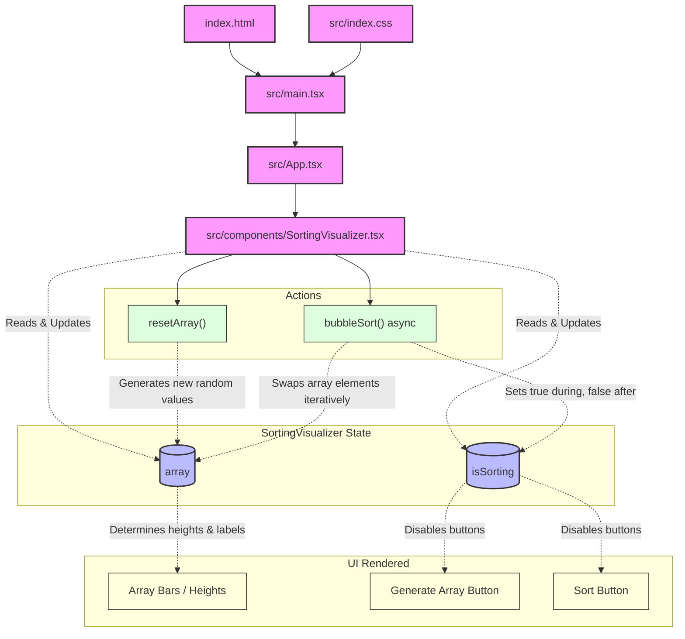

# React Bubble Sort Visualizer

A dynamic and interactive web application built with React and Vite that visualizes the Bubble Sort algorithm. Watch as columns representing numbers swap places in real-time until the array is fully sorted.

## Features

- **Visual Representation**: See the numbers represented as varying heights of columns.
- **Animation**: The sorting process is paced with delays, allowing you to clearly see the `O(n^2)` swapping logic of Bubble Sort.
- **Interactive Controls**: Generate new random arrays on demand and start the sorting process at the click of a button.

## Prerequisites

- Ensure you have [Node.js](https://nodejs.org/) installed.
- (Optional but Recommended) Use `nvm` (Node Version Manager) to manage your Node version. This project includes an `.nvmrc` file specifying the LTS version.

## How to Run Locally

1. **Clone the repository** (if you haven't already):
   ```bash
   git clone https://github.com/Didithekli/react-bubblesort-visualizer.git
   cd react-bubblesort-visualizer
   ```

2. **Use the correct Node version**:
   If you have `nvm` installed, simply run:
   ```bash
   nvm use
   ```

3. **Install Dependencies**:
   ```bash
   npm install
   ```

4. **Start the Development Server**:
   ```bash
   npm run dev
   ```
   
5. **Open in Browser**:
   Navigate to the local URL provided in your terminal (usually `http://localhost:5173/`).

## How It Works

The core of the application lives in `src/components/SortingVisualizer.tsx`. It maintains state utilizing React hooks (`useState`, `useEffect`).

When you click "Sort!", the `bubbleSort` function is triggered. This function is an `async` adaptation of the classic algorithm. It uses a `Promise` combined with `setTimeout` to maliciously pause the execution thread inside the loop. After every swap, it updates the component's state, triggering a re-render of the DOM so you visually see the bars swap places before the next iteration begins. 

## Build for Production

To create an optimized production build, run:
```bash
npm run build
```
The output will be located in the `dist/` directory, ready to be deployed to any static hosting service.

## Architecture

This diagram outlines the component structure and data flow of the application.


